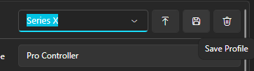

# About
Since going through the effort of getting your firmware, prod.keys, and games from the Nintendo Switch™ using methods along the lines of "[RCM](https://switch.hacks.guide/user_guide/rcm/)" or "[Modchipping](https://switch.hacks.guide/user_guide/modchip/)" was extremely difficult for me to achieve, I managed to find a way that allows not only for you, the user, to **emulate the Nintendo Switch™**, but also **get just about any game from Nintendo®** (if supported by the Nintendo Switch™).

 

# How did I achieve this?
Simply put, I just browsed the internet for 2 hours straight looking for the key items needed:
* an emulator (Ryujinx)
* prod.keys (Product keys) & title.keys (Title keys)
* firmware (The Nintendo Switch™ firmware)
* games (Any [NSP](https://file.org/extension/nsp) or [XCI](https://file.org/extension/xci) game files)

 
 

# Lets begin
Starting from now will be a "tutorial" on how to achieve this blissfull setup that lets you easily run any Nintendo Switch™ game, without the need for an actual Nintendo Switch™ in your possession.

### Table of contents
* [Installing Ryujinx](#installing-ryujinx)
    * [Open Ryujinx](#open-ryujinx)
* [Getting your prod.keys, title.keys & firmware](#getting-your-prodkeys-titlekeys--firmware)
* [Installing your prod.keys, title.keys & firmware to Ryujinx](#installing-your-prodkeys-titlekeys--firmware-to-ryujinx)
   * [Extract Prodkeys](#extract-prodkeys)
   * [Installing the Firmware](#installing-the-firmware)
* [Setting up a controller for Ryujinx](#setting-up-a-controller-for-ryujinx)
* [Getting a game for Ryujinx to run](#getting-a-game-for-ryujinx-to-run)
    * [Add a games directory](#add-a-games-directory)
    * [Getting games (NSP or XCI)](#getting-games-nsp-or-xci)
    * [Getting Ryujinx to detect the new game](#getting-ryujinx-to-detect-the-new-game)
* [Thats it!](#thats-it)
 

# Installing Ryujinx
Lets start off with installing [Ryujinx](https://ryujinx-emulator.com/download/); Make sure to choose the [correct platform](https://mdigi.tools/operating-system/) before downloading.

### Extract to a memorable place
After the download is complete, you can extract the zip file to a memorable place, since it will also be the place where your games will be stored later.

### Open Ryujinx
Once it is finished extracting, open the folder and run "**Ryujinx.exe**". If you are on windows you should see a terminal popup with stuff wizzing by in it; This is good, and means its about to start. Once the main Ryujinx application is open; It should look like this (Ignoring the games currently listed):

Now that you have Ryujinx installed and opened, Lets get our prod.keys, title.keys, and firmware now for Ryujinx.

 

# Getting your prod.keys, title.keys & firmware
This would have been **an extremely difficult** process if we weren't blessed with one website, called [Prodkeys.net](https://prodkeys.net). This website provides and extensive list of almost **every version** of  prod.keys, title.keys and even firmware. You can find all of these here:
* [prod.keys + title.keys v16.0.0-v19.0.0](https://prodkeys.net/ryujinx-prod-keys-v2/)
* [firmwares v15.0.0-v19.0.1](https://prodkeys.net/latest-switch-firmwares-v2/)

 

It is recommended that both the prod.keys, title.keys & firmware have a version very close to each other. You should stay within a (.0)-(.1) version gap:
* v19.0.0 &larr; The last didget of the version is what you should pay attention to.

A bad example of this is downloading prod.keys & title.keys v16.0.0, and firmware v19.0.1. This gap is too much and may become quite the problem down the road.

Once you have chosen the versions of both, you simply need to click "**DOWNLOAD**" on both. You should have 2 zip files called:
* Prokeys.net vXX.X.X.zip
* Firmware.XX.X.X.zip

 

# Installing your prod.keys, title.keys & firmware to Ryujinx
Now that you have prod.keys, title.keys & firmware, you can now finally install these to Ryujinx. The process is quite simple:

### Extract Prodkeys 
Extract "**Prodkeys.net vXX.X.X.zip**" to `C:\Users\<USERNAME>\AppData\Roaming\Ryujinx\system`, insure that in `system` you delete "**Profiles.json**", as that will be re-added with new information later.

### Installing the Firmware
After extracting the Prodkeys, next is to install the selected firmware. Ryujinx makes this a very easy task, simply do the following:
1. In the **Top left** part of Ryujinx, click the "**Tools"** tab
   
   
2. Then hover over "**Install Firmware**" to show the extended menu

   
3. Finally either click "Install a firmware from a directory" if you already extracted "Firmware.XX.X.X.zip" to a folder, or "Install a firmware from XCI or ZIP" if you still have the zip file.

Now you have prod.keys, title.keys & firmware installed on Ryujinx.

 

# Setting up a controller for Ryujinx
After preparing Ryujinx with prod.keys, title.keys & firmware, we can now setup a controller that Ryujinx will use to control the game we play. This process should be quick and simple:
1. Click "**Options**" in the top left menu

   
2. Then click "**Settings**"

   
3. Go to "**Input**" from the sidemenu

   
4. Go to "**Input Device**" and select your currently connected controller (In my case Xbox Series X Controller (0))

   
5. Ryujinx should automatically change keybindings for the Xbox Series X, so don't worry about changing keybinds (If it didn't then go through the process of changing it to match)
6. Then go to the top right and create a new profile by editing the name to your liking.

    

    Then click the save button.

    

7. Finally click "**Apply**" at the bottom right of the Ryujinx settings to apply your changes to Ryujinx

Now Ryujinx has a controller that can control the emulated game.

 

# Getting a game for Ryujinx to run
Finally, we need a game. This is the hardest part of this entire document. Since it's "Illegal" this document will most likely get DMCA'd so, please IN ADVANCE someone save this with [Wayback Machine](https://web.archive.org) so it isn't lost like other tutorials have had happen to them.

### Add a Games Directory
First we need a "Games" directory for Ryujinx to detect games in. This is crucial for Ryujinx to manage and control all games we download:
1. Click "**Options**" in the top left menu

   
2. Then click "**Settings**"

   
3. Then find "**Game Directories**", it should be the first shown tab (**User Interface**) when you open the "**Settings**" menu

   
4. Click "**Add**" and find your dedicated "Games" folder

   
5. Finally click "**Apply**" and Ryujinx will now use this "**Path**" as a place to detect games.

### Getting games (NSP or XCI)
We are now at the "**Illegal**"" part of this documentation. Where get games that are suppose to be purchased, but can be freely downloaded from a specific website called [NSW2U](https://nsw2u.com/). This website provides mirror downloads to almost every game Nintendo® has published. For this documentation, we will be using [The Legend of Zelda: Tears of the Kingdom](https://nsw2u.com/the-legend-of-zelda-tears-of-the-kingdom-switch-nsp-xci-nsz-v17):
1. Scroll down until you see "**Download**" in bright red, and "**Torrent**" in bright green.

   
2. Scroll a little bit more down until you see this section (it should be right below the last section)

   
3. You can choose between any of them, but the one I chose was "**Base (eShop)**", which is an **NSP** file.
4. Then click **(Mirror)** next to **1Fichier** (Clicking 1Fichier will take you to a gallery of all eShop games instead of the download for Totk)
5. On [ouo.io](https://ouo.io), click "**I'M A HUMAN**"
6. Then click "**GET LINK**"
7. You should end up on [1fichier.com](https://1fichier.com), on a download page for "**The Legend of Zelda: Tears of the Kingdom**".

   
8. Click "**Download**", It will then redirect to a bigger "**Click here to download the file**" button that will actually download the game.

   

9. Once the download finished you should end up with a zip called "**The Legend of Zelda Breath of the Wild [XXXXXXXXXXXXXXXX][v0][US].nsp**"
10. Finally extract the game to your "**Games**" folder.

You now have your game ready to play, now lets get Ryujinx to detect it.

### Getting Ryujinx to detect the new game
Simply click the little  at the bottom left of the Ryujinx app:

Finally, the last "Finally", double click the newly shown game in the "**Games Directory**" as shown below:

Or right click, and click "**Run Application**"

 

# Thats it!
Yea, thats really it. Simple right? It's truely crazy how easy this is to just bypass paying $60 worth of a game, and over $300 for a Nintendo Switch™. With that out of the way, I hope you enjoy playing your newley aquired "**The Legend of Zelda: Tears of the Kingdom**".

2019-2024 &copy; Wo-r 
